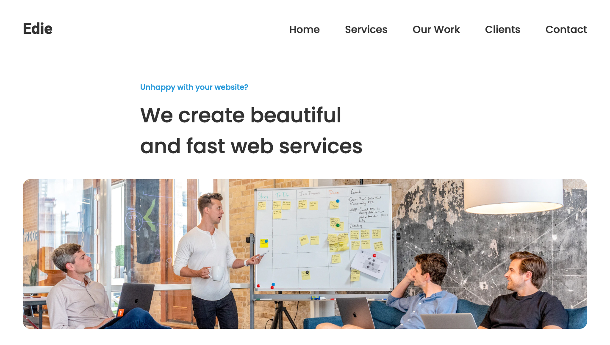

<h1 align="center">devChallenges - Edie Homepage</h1>

   Solution for a challenge from  <a href="http://devchallenges.io" target="_blank">devChallenges.io</a>.

  <h3>
    <a href="https://nakoyawilson.github.io/devChallenges-edie-homepage/">
      Demo
    </a>
     | 
    <a href="https://devchallenges.io/solutions/SfJPHpAKy31w47KJWRc0">
      Solution
    </a>
     | 
    <a href="https://devchallenges.io/challenges/xobQBuf8zWWmiYMIAZe0">
      Challenge
    </a>
  </h3>

<!-- TABLE OF CONTENTS -->

## Table of Contents

- [Overview](#overview)
  - [Built With](#built-with)
- [Features](#features)
- [Contact](#contact)

<!-- OVERVIEW -->

## Overview

### Built With

- HTML
- CSS
- JavaScript

## Features

This application/site was created as a submission to a [DevChallenges](https://devchallenges.io/challenges) challenge. The [challenge](https://devchallenges.io/challenges/xobQBuf8zWWmiYMIAZe0) was to build an application to complete the following user stories:

- [x] User story: I can see a page following the given design
- [x] User story: I can see a page on mobile following the given design
- [x] User story: I can go to certain locations by selecting links in navigation or footer

## Contact

- Website: [Nakoya Wilson](https://nakoyawilson.netlify.app/)
- GitHub: [@nakoyawilson](https://github.com/nakoyawilson)
- Twitter: [@nakoyawilson](https://twitter.com/nakoyawilson)
